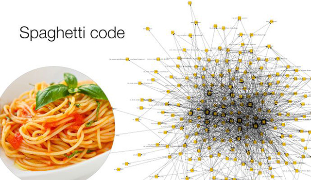
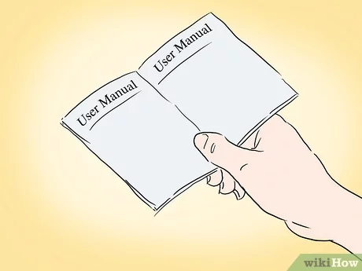

# 1. Apunts_UF2_2 

## Optimització de codi

### "Hediondez del codigo"

La "Hediondez del codigo" és codi que s'ha fet aplicant males pràctiques i que en un període curt de temps no dóna errors però en un període llarg pot donar.

### Anàlisis dinàmic del codi

Quan es vol analitzar el codi hi han dues formes de fer-ho estèticament o dinàmicament. En l'anàlisis dinàmic el codi s'analitza quan està en execució això ens permet veure més errors que en l'estàtic però és més lent.

Hi ha eines per fer això, aquestes varien segons el llenguatge per exemple si volem analitzar el codi dinàmicament en Java tenim JUnit.

### Anàlisis estàtic del codi

L'anàlisis estàtic del codi és quan el codi s'analitza sense que estigui en execució. Aquest tipus permet trobar errors al principi del desenvolupament de l'aplicació, pàgina web etc, ja que no fa falta executar-ho.

També tenim eines, que varien segons el llenguatge, per exemple si volem fer un anàlisis estàtic amb C tenim lint

### Refactorització

Quan parlem de refactorització del codi estem parlant de canviar "l'esquelet" (estructura) del codi per fer-lo més net i llegible o més optimitzat.

## Documentació 

La documentació del teu programa o pàgina web pot variar segons a qui estigui dirigida per això hi ha tres tipus.

- Documentació de codi font
- Aquest tipus de documentació serveix per saber que fa el codi i perquè aquestes variables, mètodes o classes existeixen, la documentació tècnica va dirigida principalment als "software engineers"
- Documentació tècnica
- Aquest tipus de documentació serveix perquè un usuari pugui resoldre un problema tècnic seria com un tutorial de YouTube però en paper. Aquesta va dirigida principalment als usuaris
- Documentació d'usuari
- Aquest tipus de documentació serveix per a què un usuari sàpiga utilitzar el programa. Va dirigida principalment als usuaris sense coneixements.
  
  

## Control de versions
Quan parlem de control de versions estem parlant de com mantenir, controlar o millorar una versió del teu programa.

Per fer això hi ha vàries eines i aquestes poden variar segons les necessitats per exemple si fas videojocs aquests tenen arxius binaris molt pesats per tant és recomanable utilitzar force, però si en canvi tens una pàgina web, git és una molt bona opció.

  

